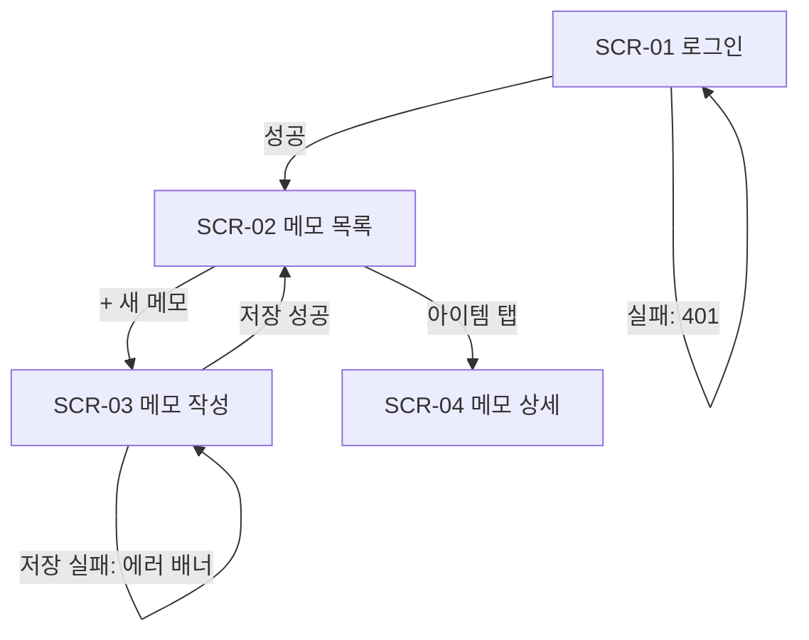

# MVP 디자인 스펙 표준

> design-spec.md는 그림 도구 없이 **텍스트만으로** 구현 가능한 수준까지 화면을 확정하는 단일 산출물이다.
> `ux-designer`는 이 문서만 쓰고 코드는 생성하지 않는다.
> 모든 화면은 PRD 스토리에 매핑되어야 하며, 매핑은 `gate-design.sh`가 결정론적으로 검사한다.

## When to Apply

다음 상황에서 이 스킬을 참조한다:

- `ux-designer`가 Stage 2(디자인)에서 `.planning/design-spec.md`를 작성·수정할 때
- `product-strategist`가 Stage 2 checker로 커버리지 매트릭스(스토리×화면)를 검증할 때
- `/mvp-gate` 실행 결과 `gate-design.sh`가 실패(`[story: S-xx]` 태그 누락)하여 원인을 진단·교정할 때
- `mvp-builder`가 Stage 4 루프에서 화면 구현 시 화면 명세·4상태·디자인 토큰을 구현 기준으로 삼을 때
- 스코프 재협상으로 스토리가 추가·분할되어 디자인 스펙에 화면·태그를 증분 반영할 때

## 1. 핵심 규칙

| # | 규칙 | 집행 주체 |
|---|------|-----------|
| R1 | design-spec.md는 필수 6섹션을 §2 순서대로 포함한다 | `product-strategist` 검증 |
| R2 | prd.json의 **모든** 스토리 id가 `[story: S-xx]` 정확 형식으로 1회 이상 등장한다 (§3) | `gate-design.sh` grep |
| R3 | 매핑 태그 변형 금지 — 대소문자·공백·축약 어긋나면 게이트 실패 | `gate-design.sh` grep -F |
| R4 | 모든 화면은 빈/로딩/에러/성공 4상태를 정의한다 (§6) | `product-strategist` 검증 |
| R5 | 디자인 토큰은 색·타이포·간격 최소 셋을 표로 정의하고, 화면 명세는 토큰 이름으로 참조한다 (§7) | `mvp-builder` 구현 기준 |
| R6 | 커버리지 매트릭스에 prd.json 전 스토리가 행으로 존재하고 빈 행이 없어야 한다 (§9) | `product-strategist` 검증 입력 |
| R7 | 코드(HTML/CSS/컴포넌트 코드) 생성 금지 — 산출물은 design-spec.md 단일 파일 | `ux-designer` Boundaries |

## 2. design-spec.md 필수 구조

아래 6개 `##` 섹션을 이 순서대로 포함한다.

| 순서 | 섹션 헤딩 | 내용 |
|------|-----------|------|
| 1 | `## IA` | 정보 구조 트리 — 화면 계층과 진입 관계 |
| 2 | `## 유저 플로우` | Mermaid flowchart — 핵심 여정 + 실패 분기 |
| 3 | `## 화면 명세` | 화면별 `### SCR-xx 이름 [story: S-xx]` + 와이어프레임 + 4상태 |
| 4 | `## 디자인 토큰` | 색·타이포·간격 표 (§7) |
| 5 | `## 컴포넌트 인벤토리` | 재사용 컴포넌트 목록 + 사용 화면 (§8) |
| 6 | `## 커버리지 매트릭스` | 스토리×화면 표 (§9) |

### IA 트리 예시

```text
앱 루트
├── SCR-01 로그인          (비로그인 진입점)
└── SCR-02 메모 목록        (로그인 후 홈)
    ├── SCR-03 메모 작성    (목록의 [+ 새 메모])
    └── SCR-04 메모 상세    (목록 아이템 탭)
```

### Mermaid 유저플로우 예시



성공 경로만 그리지 않는다 — 실패·이탈 분기 1개 이상 포함.

## 3. `[story: S-xx]` 매핑 태그 — 정확 형식

`gate-design.sh`는 prd.json의 각 id에 대해 `grep -qF "[story: S-xx]"`로 검사한다.
**고정 문자열 비교**이므로 한 글자라도 다르면 해당 스토리는 미커버로 판정된다.

형식 규칙: `[story: S-01]`
— 여는 대괄호 + 소문자 `story` + 콜론 + **공백 정확히 1개** + 대문자 `S` + 하이픈 + 2자리 숫자 + 닫는 대괄호.

| 판정 | 표기 | 사유 |
|------|------|------|
| GOOD | `[story: S-01]` | 정확 형식 |
| GOOD | `[story: S-01] [story: S-02]` | 복수 스토리는 태그를 **반복** |
| BAD | `[Story: S-01]` | 대문자 S로 시작 |
| BAD | `[story:S-01]` | 콜론 뒤 공백 누락 |
| BAD | `[story: s-01]` | 소문자 id |
| BAD | `[story: S-1]` | 자릿수 불일치(2자리 필수) |
| BAD | `[story: S-01, S-02]` | 축약 — S-02가 grep -F에 잡히지 않음 |

배치 위치: 각 화면 명세의 `###` 헤딩 라인에 붙인다(권장). 화면 외 요소(공통 레이아웃 등)에
스토리가 걸리면 해당 단락 첫 줄에 태그를 둔다. prd.json의 모든 스토리가 어딘가에 1회 이상
등장해야 게이트 통과 — 화면이 없는 스토리(예: 순수 API 스토리)도 가장 가까운 화면 또는
"비화면 동작" 단락에 태그로 귀속시킨다.

## 4. 화면 명세 양식

화면마다 아래 형식을 따른다:

```markdown
### SCR-02 메모 목록 [story: S-02] [story: S-03]

- 목적: 내 메모를 최신순으로 훑고 작성·상세로 이동하는 허브
- 진입 경로: 로그인 성공 직후 / 작성·상세에서 뒤로가기
- 와이어프레임: (§5 컨벤션)
- 상태 정의: (§6 표)
- 인터랙션:
  - [+ 새 메모] 탭 → SCR-03 이동
  - 리스트 아이템 탭 → SCR-04 이동
  - 당겨서 새로고침 → 목록 재조회(로딩 상태 표시)
```

## 5. ASCII 와이어프레임 컨벤션

텍스트 박스 문자로 레이아웃을 고정한다. 픽셀 정밀도가 아니라 **요소 존재·순서·위계**를 확정하는 것이 목적.

| 표기 | 의미 |
|------|------|
| `┌─┐ │ └─┘` | 화면/카드 경계 |
| `├─┤` | 영역 구분선 |
| `[텍스트]` | 버튼(탭 가능 액션) |
| `(텍스트____)` | 입력 필드(괄호 안은 placeholder) |
| `▸` | 리스트 아이템 |
| `←` 화살표 주석 | 와이어프레임 우측 설명(렌더링 대상 아님) |

예시 — SCR-02 메모 목록:

```text
┌──────────────────────────────────┐
│ 메모                [+ 새 메모]  │ ← 헤더: 타이틀(heading) + 주요 액션 버튼
├──────────────────────────────────┤
│ (메모 검색____________________)  │ ← 입력 필드, space-4 패딩
├──────────────────────────────────┤
│ ▸ 장보기 목록         2026-06-11 │ ← 아이템: 제목(body) + 날짜(caption, muted)
│ ▸ 회의 메모           2026-06-10 │
│ ▸ 아이디어            2026-06-09 │
├──────────────────────────────────┤
│         [더 불러오기]            │ ← 페이지네이션 버튼, 마지막 페이지면 숨김
└──────────────────────────────────┘
```

## 6. 4상태 의무 — 빈/로딩/에러/성공

모든 화면 명세는 아래 4상태를 표로 정의한다. 하나라도 빠지면 `mvp-builder`가 임의 구현하게 되고,
`mvp-verifier`의 AC 반증(빈 입력·실패 케이스)에서 적발된다.

| 상태 | 정의 의무 사항 | SCR-02 예시 |
|------|----------------|-------------|
| 빈(empty) | 데이터 0건 표시 문구 + 다음 행동 유도 | "메모가 없습니다" + [첫 메모 작성] |
| 로딩(loading) | 표시 방식(스켈레톤/스피너)과 위치 | 리스트 영역 스켈레톤 3행 |
| 에러(error) | 메시지 + 복구 액션 | "목록을 불러오지 못했습니다" + [다시 시도] |
| 성공(success) | 정상 표시 규칙(정렬·포맷·최대 노출 수) | createdAt 내림차순, 날짜 `yyyy-MM-dd`, 페이지당 20건 |

### 나쁜 예 / 좋은 예

```text
BAD : "목록 화면: 메모를 보여준다"            ← 0건일 때? 실패하면? 정렬은?
GOOD: 위 4상태 표 — 상태마다 표시 내용과 사용자의 다음 행동이 한 줄씩 확정됨
```

## 7. 디자인 토큰 최소 셋

색·타이포·간격 3종은 반드시 정의한다. 화면 명세·와이어프레임 주석은 raw 값(`#3B82F6`, `16px`)이
아니라 **토큰 이름**으로 참조한다. 구현 단계에서 `tech-architect`/`mvp-builder`가 스택에 맞게
(CSS 변수, Tailwind 테마 등) 옮긴다.

### 색 (최소 6)

| 토큰 | 값 | 용도 |
|------|-----|------|
| `color-primary` | `#2563EB` | 주요 액션 버튼, 링크 |
| `color-on-primary` | `#FFFFFF` | primary 위 텍스트 |
| `color-surface` | `#FFFFFF` | 카드·화면 배경 |
| `color-text` | `#111827` | 본문 텍스트 |
| `color-muted` | `#6B7280` | 보조 텍스트, 날짜·메타 |
| `color-danger` | `#DC2626` | 에러 메시지, 파괴적 액션 |

### 타이포 (패밀리 1 + 스케일 4)

| 토큰 | 크기/굵기/행간 | 용도 |
|------|----------------|------|
| `font-family` | Pretendard, sans-serif | 전체 |
| `type-heading` | 20px / 700 / 1.3 | 화면 타이틀 |
| `type-body` | 16px / 400 / 1.5 | 본문, 리스트 제목 |
| `type-caption` | 13px / 400 / 1.4 | 메타 정보, 날짜 |
| `type-button` | 15px / 600 / 1.0 | 버튼 라벨 |

### 간격 (4px 그리드)

| 토큰 | 값 | 용도 |
|------|-----|------|
| `space-1` | 4px | 아이콘-라벨 간격 |
| `space-2` | 8px | 인라인 요소 간격 |
| `space-4` | 16px | 컴포넌트 내부 패딩, 화면 좌우 여백 |
| `space-6` | 24px | 섹션 간 간격 |
| `space-8` | 32px | 화면 상하 대여백 |

값은 프로젝트 성격에 맞게 바꿔도 되지만 **토큰 이름 체계와 4px 배수 규칙은 유지**한다.

## 8. 컴포넌트 인벤토리

화면 명세에서 2회 이상 등장하는 요소를 컴포넌트로 추출해 표로 관리한다.
`mvp-builder`가 중복 구현 대신 재사용 단위를 식별하는 입력이다.

| 컴포넌트 | 설명 | 상태/변형 | 사용 화면 |
|----------|------|-----------|-----------|
| `PrimaryButton` | color-primary 채움 버튼 | default / disabled / loading | SCR-01, SCR-03 |
| `ListItem` | 제목 + caption 메타 행 | default / pressed | SCR-02 |
| `EmptyState` | 빈 상태 문구 + 유도 버튼 | 문구·버튼 라벨 주입 | SCR-02, SCR-04 |
| `ErrorBanner` | color-danger 배너 + 재시도 | 메시지 주입 | 전 화면 공통 |

## 9. 커버리지 매트릭스

`product-strategist`가 Stage 2 검증에서 그대로 대조하는 입력. 행 = prd.json 전 스토리(누락 금지),
열 = 화면 명세의 전 화면. `●` = 해당 화면이 그 스토리를 구현 표면으로 커버.

```markdown
| 스토리 | SCR-01 로그인 | SCR-02 메모 목록 | SCR-03 메모 작성 | SCR-04 메모 상세 | 커버 |
|--------|:---:|:---:|:---:|:---:|------|
| S-01 이메일 로그인     | ● |   |   |   | ✅ |
| S-02 메모 목록 조회    |   | ● |   |   | ✅ |
| S-03 메모 작성         |   | ● | ● |   | ✅ |
| S-04 메모 상세·삭제    |   |   |   | ● | ✅ |
```

검증 판정 규칙:

| 발견 | 판정 |
|------|------|
| 빈 행(어느 화면에도 미커버 스토리) | 실패 — 화면 추가 또는 §3 비화면 동작 태그 귀속 후 재검 |
| 빈 열(어느 스토리에도 안 걸린 화면) | 경고 — 스코프 외 화면 의심, 범위 비대 신호로 PS가 지적 |
| 매트릭스의 행 수 ≠ prd.json 스토리 수 | 실패 — 매트릭스 갱신 누락 |

매트릭스는 `gate-design.sh`(태그 grep)와 별개의 **의미 검증** 층이다: 게이트는 태그 존재만,
매트릭스는 매핑이 말이 되는지를 product-strategist가 확인한다.
