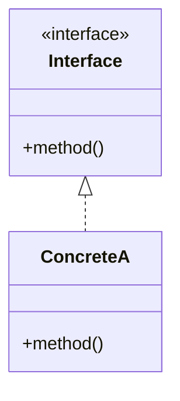

# <% tp.file.title %>

> [!abstract] 패턴 한줄 요약
> <% tp.file.cursor(1) %>

---

## 1. 패턴 개요

### 정의


### 해결하는 문제

-

### 분류

| 항목 | 값 |
|------|---|
| 패턴 유형 | 생성 / 구조 / 행위 / 아키텍처 |
| 적용 범위 | 클래스 / 객체 / 시스템 / 분산 |
| 복잡도 | 낮음 / 보통 / 높음 |

---

## 2. 구조 다이어그램

### Mermaid 다이어그램



### Excalidraw 다이어그램

<!-- Excalidraw 플러그인으로 구조도 작성 후 아래 주석 해제 -->
<!-- ![[Assets/Excalidraw/패턴명-structure.excalidraw]] -->

---

## 3. 구현 예제

### 기본 구현

```
// 패턴 기본 구현 코드
```

### 실전 적용

```
// 프로젝트에서의 실전 적용 코드
```

> [!tip] 구현 핵심 포인트
>

---

<!-- 선택 섹션: 필요시 주석 해제 후 작성 -->

<!--
## 4. 적용 시나리오

### 사용해야 할 때
-

### 사용하면 안 되는 경우
-
-->

<!--
## 5. 트레이드오프

### 장점
-

### 단점
-
-->

<!--
## 6. 관련 패턴

### 자주 함께 사용되는 패턴
- [[]] - 관계 설명

### 대안 패턴
- [[]] - 대안 설명
-->

---

## 학습 체크리스트

- [ ] 패턴 정의 및 목적 이해
- [ ] 다이어그램 직접 그려보기
- [ ] 기본 구현 코드 작성
- [ ] 실전 적용 시나리오 1개 이상 구현
- [ ] 트레이드오프 정리
- [ ] 1주 후 복습 [scheduled:: <% tp.date.now("YYYY-MM-DD", 7) %>]
